<div align="center">
  
</div>

<div align="center">
  
</div>

<div align="center">
  
</div>

<h3 align="center">🚀 Passionate IoT Developer | Embedded Systems • Web Development • Open Source</h3>

<div align="center">
  
[](https://linkedin.com/in/your-profile)
[](https://youtube.com/@yourchannel)
[](https://twitter.com/yourhandle)
[](https://yourwebsite.com)


</div>

---

## 🧑‍💻 About Me


```yaml
name: Your Name
role: IoT & Embedded Systems Developer
location: Your City, Country
current_focus: Building safer, smarter connected solutions
coding_since: 2018
interests:
  - Internet of Things (IoT)
  - Embedded Systems & Real-Time Computing
  - Cybersecurity & Hardware Security
  - Home Automation & Smart Cities
  - Open Source Hardware & Software
current_stack: [C/C++, Python, ESP32, Firebase, React]
learning: Advanced Machine Learning on Edge Devices
fun_fact: I once automated my coffee machine to brew based on my calendar! ☕
motto: "Code with purpose, build with passion"
```

🔭 **Currently Working On:** Revolutionary IoT security framework for smart homes  
🌱 **Learning:** TinyML, LoRaWAN protocols, and edge AI optimization  
💡 **Philosophy:** Technology should make life safer, smarter, and more connected  
⚡ **Hobbies:** Tinkering with microcontrollers, contributing to open-source projects  
🎯 **2024 Goals:** Launch 3 open-source IoT projects, mentor 50+ developers  

---

## 🛠️ Tech Stack & Tools

<div align="center">

### Programming Languages


### IoT & Embedded


### Web & Cloud


### Tools & Platforms


</div>

---

## 📊 GitHub Analytics

<div align="center">
  
  
</div>

<div align="center">
  
</div>

<div align="center">
  
</div>

---

## 🚀 Innovation Showcase

<div align="center">
  
  
  
</div>

### 🏗️ Current Projects Roadmap

```mermaid
graph TD
    A[🆘 Women Safety SOS] --> B[Real-time GPS Tracking]
    A --> C[Multi-channel Alerts] 
    A --> D[Encrypted Communication]
    
    E[💡 Smart Home Hub] --> F[Voice Control Integration]
    E --> G[Energy Analytics]
    E --> H[Environmental Monitoring]
    
    I[🔒 IoT Security Framework] --> J[Device Authentication]
    I --> K[Secure Communication]
    I --> L[Vulnerability Assessment]
```



<div align="center">

[](https://github.com/yourusername/women-safety-sos)
[](https://github.com/yourusername/smart-home-hub)

</div>

## 🎯 Featured Projects Portfolio

<div align="center">

[](https://github.com/yourusername/women-safety-sos)
[](https://github.com/yourusername/smart-home-hub)

</div>

<details>
<summary><b>🆘 Women Safety SOS System</b> - <i>Click to expand</i></summary>
<br>

**🎯 Mission:** Empower women with instant emergency response technology

**🔧 Technical Architecture:**
- **Hardware:** ESP32-S3, GPS Module, GSM Module, Panic Button
- **Backend:** Firebase Realtime Database, Cloud Functions
- **Notifications:** Twilio SMS, SendGrid Email, Push Notifications
- **Security:** AES-256 encryption, HTTPS/TLS communication

**📈 Impact Metrics:**
- ⚡ <2 second alert dispatch time
- 📍 GPS accuracy within 3 meters
- 🔋 72-hour battery backup
- 📱 Cross-platform mobile app

**🏆 Recognition:** Winner - National Women Safety Hackathon 2024

</details>

<details>
<summary><b>💡 Smart Home Automation Hub</b> - <i>Click to expand</i></summary>
<br>

**🎯 Vision:** Transform homes into intelligent, energy-efficient ecosystems

**🔧 System Components:**
- **Central Hub:** Raspberry Pi 4 with custom PCB shield
- **Sensors:** Temperature, humidity, motion, light, air quality
- **Actuators:** Smart switches, servo motors, LED controllers
- **Integration:** Google Assistant, Alexa, MQTT broker

**📊 Key Features:**
- 🎤 Voice control in 5+ languages
- ⚡ 40% average energy savings
- 📱 Real-time mobile monitoring
- 🤖 AI-powered automation routines

**💡 Innovation:** Predictive energy management using ML algorithms

</details>

---

## 🌟 Open Source Contributions & Community Impact

---

## 💼 Professional Journey & Impact

<table align="center">
  <tr>
    <td align="center" width="33%">
      <br>
      <sub><b>Successfully delivered IoT solutions</b></sub>
    </td>
    <td align="center" width="33%">
      <br>
      <sub><b>IoT devices in production</b></sub>
    </td>
    <td align="center" width="33%">
      <br>
      <sub><b>Through safety & automation solutions</b></sub>
    </td>
  </tr>
</table>

### 📊 Technical Expertise Breakdown

<div align="center">
  
| **Domain** | **Technologies** | **Experience** | **Projects** |
|------------|------------------|----------------|--------------|
| **IoT Development** | ESP32, Arduino, Raspberry Pi | 5+ years | 15+ projects |
| **Embedded Systems** | C/C++, FreeRTOS, STM32 | 4+ years | 12+ projects |
| **Cloud Integration** | Firebase, AWS IoT, Azure | 3+ years | 10+ projects |
| **Web Development** | React, Node.js, Python | 3+ years | 8+ projects |
| **Security** | Cryptography, PKI, Secure Boot | 2+ years | 5+ projects |

</div>

<div align="center">
  
</div>

---

## 📈 Weekly Development Breakdown

<!--START_SECTION:waka-->
```text
C/C++        12 hrs 30 mins  ██████████░░░  45.2%
Python        8 hrs 15 mins  ███████░░░░░░  29.8%
JavaScript    4 hrs 20 mins  ████░░░░░░░░░  15.7%
YAML          1 hr 45 mins   ██░░░░░░░░░░░   6.3%
Other         52 mins        █░░░░░░░░░░░░   3.0%
```
<!--END_SECTION:waka-->

---

## 🏅 Achievements & Certifications

<div align="center">


</div>

🎓 **Certifications:**
- AWS IoT Core Specialist
- Certified Ethical Hacker (CEH)
- Google Assistant Actions Developer

🏆 **Achievements:**
- Winner, National IoT Hackathon 2024
- Open Source Contributor of the Month
- Featured in Tech Today Magazine

---

## 📬 Let's Connect & Collaborate

<div align="center">

<table>
  <tr>
    <td align="center">
      <a href="mailto:youremail@example.com">
        
      </a>
    </td>
    <td align="center">
      <a href="https://linkedin.com/in/your-profile">
        
      </a>
    </td>
    <td align="center">
      <a href="https://twitter.com/yourhandle">
        
      </a>
    </td>
    <td align="center">
      <a href="https://discord.gg/yourserver">
        
      </a>
    </td>
  </tr>
</table>

### 📬 Let's Connect & Collaborate

<div align="center">

<a href="https://www.linkedin.com/in/your-profile">
  
</a>
<a href="https://twitter.com/yourhandle">
  
</a>
<a href="mailto:youremail@example.com">
  
</a>
<a href="https://yourwebsite.com">
  
</a>

<br><br>

### 🤝 Open to Opportunities

<table>
  <tr>
    <td align="center" width="25%">
      <br>
      <sub><b>Collaboration</b></sub><br>
      <sub>IoT & Embedded Projects</sub>
    </td>
    <td align="center" width="25%">
      <br>
      <sub><b>Mentoring</b></sub><br>
      <sub>Aspiring Developers</sub>
    </td>
    <td align="center" width="25%">
      <br>
      <sub><b>Innovation</b></sub><br>
      <sub>Tech Solutions</sub>
    </td>
    <td align="center" width="25%">
      <br>
      <sub><b>Open Source</b></sub><br>
      <sub>Contributions</sub>
    </td>
  </tr>
</table>

</div>

<div align="center">
  <h3>📧 Quick Connect</h3>
  <p>
    <b>Email:</b> <a href="mailto:youremail@example.com">youremail@example.com</a><br>
    <b>Calendar:</b> <a href="https://calendly.com/yourname">Schedule a meeting</a><br>
    <b>Response time:</b> Usually within 24 hours ⚡
  </p>
</div>

</div>

---

<div align="center">
  
*"The best way to predict the future is to create it."* – Peter Drucker


**Thanks for visiting! 🙏 Don't forget to ⭐ some repositories if you find them interesting!**

</div>

---

<details>
<summary>📊 <b>Detailed GitHub Metrics</b></summary>
<br>


</details>
