<div align="center">
  
</div>

<div align="center">
  
</div>

<div align="center">
  
</div>

<h3 align="center">🚀 Passionate IoT Developer | Embedded Systems • Web Development • Open Source</h3>

<div align="center">
  
[](https://linkedin.com/in/your-profile)
[](https://youtube.com/@yourchannel)
[](https://twitter.com/yourhandle)
[](https://yourwebsite.com)


</div>

---

## 🧑‍💻 About Me


```yaml
name: Your Name
role: IoT & Embedded Systems Developer
location: Your City, Country
current_focus: Building safer, smarter connected solutions
coding_since: 2018
interests:
  - Internet of Things (IoT)
  - Embedded Systems & Real-Time Computing
  - Cybersecurity & Hardware Security
  - Home Automation & Smart Cities
  - Open Source Hardware & Software
current_stack: [C/C++, Python, ESP32, Firebase, React]
learning: Advanced Machine Learning on Edge Devices
fun_fact: I once automated my coffee machine to brew based on my calendar! ☕
motto: "Code with purpose, build with passion"
```

🔭 **Currently Working On:** Revolutionary IoT security framework for smart homes  
🌱 **Learning:** TinyML, LoRaWAN protocols, and edge AI optimization  
💡 **Philosophy:** Technology should make life safer, smarter, and more connected  
⚡ **Hobbies:** Tinkering with microcontrollers, contributing to open-source projects  
🎯 **2024 Goals:** Launch 3 open-source IoT projects, mentor 50+ developers  

---

## 🛠️ Tech Stack & Tools

<div align="center">

### Programming Languages


### IoT & Embedded


### Web & Cloud


### Tools & Platforms


</div>

---

## 📊 Advanced GitHub Analytics & Performance

<div align="center">
  
</div>

### 📈 **Comprehensive GitHub Statistics**

<div align="center">
<table>
<tr>
<td width="50%" align="center">

**📊 Repository Statistics**


</td>
<td width="50%" align="center">

**🔥 Contribution Streak**


</td>
</tr>
</table>
</div>

<div align="center">

**🎯 Language Distribution & Code Quality**


</div>

### 🏆 **Achievement Matrix & Code Quality Metrics**

<div align="center">
<table>
<tr>
<td align="center" width="25%">
  <br>
  <sub><b>Maintainability Index: 85+</b></sub><br>
  <sub>Technical Debt Ratio: <5%</sub>
</td>
<td align="center" width="25%">
  <br>
  <sub><b>Unit Tests: 450+</b></sub><br>
  <sub>Integration Tests: 120+</sub>
</td>
<td align="center" width="25%">
  <br>
  <sub><b>API Documentation Complete</b></sub><br>
  <sub>README Quality Score: A+</sub>
</td>
<td align="center" width="25%">
  <br>
  <sub><b>Vulnerabilities: 0</b></sub><br>
  <sub>Code Scanning: Enabled</sub>
</td>
</tr>
</table>
</div>

### 📊 **Development Activity Heatmap**

<div align="center">
  
</div>

### ⚡ **Real-Time Development Metrics**

<div align="center">
<table>
<tr>
<td width="33%" align="center">

**🔥 This Week**
```yaml
Commits: 42
Lines Added: 1,247
Lines Removed: 503
Files Changed: 28
Pull Requests: 6 merged
Issues Resolved: 9
```

</td>
<td width="33%" align="center">

**📈 This Month**
```yaml
Active Days: 28/31
Avg Commits/Day: 3.2
Languages Used: 8
New Features: 15
Bug Fixes: 23
Documentation: 12 updates
```

</td>
<td width="33%" align="center">

**🎯 This Year**
```yaml
Total Commits: 1,456
Repositories: 35
Stars Earned: 2,340
Forks Received: 456
Contributors: 89
Impact Score: 9.2/10
```

</td>
</tr>
</table>
</div>

### 🏅 **GitHub Achievements & Trophies**

<div align="center">
  
</div>

### 📊 **Detailed Analytics Dashboard**

<div align="center">

[](https://github.com/yourusername)
[](https://github.com/yourusername?tab=overview)
[](https://github.com/yourusername?tab=repositories)

</div>

### 🎯 **Code Efficiency Metrics**

<div align="center">
<table>
<tr>
<td align="center" width="20%">
  <br>
  <sub><b>Performance</b></sub><br>
  <sub>Avg Build Time: 2.3min</sub><br>
  <sub>Success Rate: 96.8%</sub>
</td>
<td align="center" width="20%">
  <br>
  <sub><b>Bug Resolution</b></sub><br>
  <sub>Avg Fix Time: 4.2hrs</sub><br>
  <sub>Critical Bugs: 0</sub>
</td>
<td align="center" width="20%">
  <br>
  <sub><b>Code Review</b></sub><br>
  <sub>Reviews Given: 156</sub><br>
  <sub>Approval Rate: 94%</sub>
</td>
<td align="center" width="20%">
  <br>
  <sub><b>Collaboration</b></sub><br>
  <sub>PRs Merged: 89%</sub><br>
  <sub>Team Projects: 12</sub>
</td>
<td align="center" width="20%">
  <br>
  <sub><b>Innovation</b></sub><br>
  <sub>New Features: 47</sub><br>
  <sub>Experiments: 23</sub>
</td>
</tr>
</table>
</div>

---

## 🚀 Innovation Showcase

<div align="center">
  
  
  
</div>

### 🏗️ Current Projects Roadmap

```mermaid
graph TD
    A[🆘 Women Safety SOS] --> B[Real-time GPS Tracking]
    A --> C[Multi-channel Alerts] 
    A --> D[Encrypted Communication]
    
    E[💡 Smart Home Hub] --> F[Voice Control Integration]
    E --> G[Energy Analytics]
    E --> H[Environmental Monitoring]
    
    I[🔒 IoT Security Framework] --> J[Device Authentication]
    I --> K[Secure Communication]
    I --> L[Vulnerability Assessment]
```



<div align="center">

[](https://github.com/yourusername/women-safety-sos)
[](https://github.com/yourusername/smart-home-hub)

</div>

## 🎯 Project Portfolio & Solutions

<div align="center">
  
</div>

### 🚀 Flagship Projects

<table>
<tr>
<td width="50%" valign="top">

#### 🆘 **Women Safety SOS System** 
[](https://github.com/yourusername/women-safety-sos)
[](https://github.com/yourusername/women-safety-sos)
[](https://github.com/yourusername/women-safety-sos)

**🎯 Mission:** Real-time emergency response system with multi-channel alerts

**⚙️ Tech Stack:**
```yaml
Hardware: ESP32-S3, GPS, GSM, Panic Button
Backend: Firebase, Node.js, Cloud Functions  
Mobile: React Native, Redux
Security: AES-256, JWT, HTTPS/TLS
APIs: Twilio SMS, SendGrid, Google Maps
```

**📊 Performance Metrics:**
- ⚡ Alert dispatch: **<2 seconds**
- 📍 GPS accuracy: **3m radius**  
- 🔋 Battery life: **72 hours**
- 👥 Active users: **500+**
- 🏆 **Winner** - National Safety Hackathon 2024

<div align="center">

[](https://your-demo-link.com)
[](https://github.com/yourusername/women-safety-sos)

</div>

</td>
<td width="50%" valign="top">

#### 💡 **Smart Home Automation Hub**
[](https://github.com/yourusername/smart-home-hub)
[](https://github.com/yourusername/smart-home-hub)
[](https://github.com/yourusername/smart-home-hub)

**🎯 Vision:** AI-powered home automation with energy optimization

**⚙️ Tech Stack:**
```yaml
Hardware: Raspberry Pi 4, Custom PCB
Sensors: DHT22, PIR, LDR, MQ-135
Control: React Dashboard, Mobile App
AI/ML: TensorFlow Lite, Predictive Models
Protocols: MQTT, WebSocket, REST API
```

**📊 Performance Metrics:**
- ⚡ Energy savings: **40% average**
- 🎤 Voice languages: **5+ supported**
- 📱 Response time: **<500ms**
- 🏠 Devices managed: **50+ per hub**
- 🤖 **Featured** on Tech Innovation Blog

<div align="center">

[](https://your-smart-home-demo.com)
[](https://docs.your-project.com)

</div>

</td>
</tr>
</table>

### 🔒 **IoT Security Framework** - *Currently Developing*

<div align="center">
<table>
<tr>
<td align="center" width="20%">
  <br>
  <sub><b>Device Auth</b></sub><br>
  <sub>PKI + Secure Boot</sub>
</td>
<td align="center" width="20%">
  <br>
  <sub><b>E2E Encryption</b></sub><br>
  <sub>AES-256 + RSA</sub>
</td>
<td align="center" width="20%">
  <br>
  <sub><b>Threat Detection</b></sub><br>
  <sub>ML-based Analysis</sub>
</td>
<td align="center" width="20%">
  <br>
  <sub><b>Secure APIs</b></sub><br>
  <sub>OAuth 2.0 + JWT</sub>
</td>
<td align="center" width="20%">
  <br>
  <sub><b>Audit Logging</b></sub><br>
  <sub>Compliance Ready</sub>
</td>
</tr>
</table>

**🎯 Goal:** Create the most comprehensive open-source IoT security solution  
**📅 Expected Release:** Q3 2024 | **🎯 Target:** 10,000+ devices secured

[](https://github.com/yourusername/iot-security-framework)

</div>

---

### 🌟 **Open Source Contributions & Community Projects**

<div align="center">

| Repository | Role | Contribution | Impact |
|------------|------|--------------|---------|
| [**Arduino-IoT-Library**](https://github.com/arduino/arduino-iot-library) | **Core Contributor** | Added ESP32-S3 support, Security modules | 2.5K+ downloads |
| [**Home-Assistant**](https://github.com/home-assistant/core) | **Component Developer** | Custom IoT device integrations | 500+ installations |
| [**PlatformIO-Core**](https://github.com/platformio/platformio-core) | **Contributor** | ESP32 debugging improvements | 15+ merged PRs |
| [**TinyML-Framework**](https://github.com/tensorflow/tflite-micro) | **Community Member** | IoT optimization examples | 200+ stars |

[](https://github.com/yourusername)
[](https://github.com/yourusername?tab=stars)

</div>

---

## 🌟 Open Source Contributions & Community Impact

---

## 💼 Professional Journey & Impact

<table align="center">
  <tr>
    <td align="center" width="33%">
      <br>
      <sub><b>Successfully delivered IoT solutions</b></sub>
    </td>
    <td align="center" width="33%">
      <br>
      <sub><b>IoT devices in production</b></sub>
    </td>
    <td align="center" width="33%">
      <br>
      <sub><b>Through safety & automation solutions</b></sub>
    </td>
  </tr>
</table>

### 📊 Technical Expertise Breakdown

<div align="center">
  
| **Domain** | **Technologies** | **Experience** | **Projects** |
|------------|------------------|----------------|--------------|
| **IoT Development** | ESP32, Arduino, Raspberry Pi | 5+ years | 15+ projects |
| **Embedded Systems** | C/C++, FreeRTOS, STM32 | 4+ years | 12+ projects |
| **Cloud Integration** | Firebase, AWS IoT, Azure | 3+ years | 10+ projects |
| **Web Development** | React, Node.js, Python | 3+ years | 8+ projects |
| **Security** | Cryptography, PKI, Secure Boot | 2+ years | 5+ projects |

</div>

<div align="center">
  
</div>

---

## 📈 Weekly Development Breakdown

<!--START_SECTION:waka-->
```text
C/C++        12 hrs 30 mins  ██████████░░░  45.2%
Python        8 hrs 15 mins  ███████░░░░░░  29.8%
JavaScript    4 hrs 20 mins  ████░░░░░░░░░  15.7%
YAML          1 hr 45 mins   ██░░░░░░░░░░░   6.3%
Other         52 mins        █░░░░░░░░░░░░   3.0%
```
<!--END_SECTION:waka-->

---

## 🏅 Achievements & Certifications

<div align="center">


</div>

🎓 **Certifications:**
- AWS IoT Core Specialist
- Certified Ethical Hacker (CEH)
- Google Assistant Actions Developer

🏆 **Achievements:**
- Winner, National IoT Hackathon 2024
- Open Source Contributor of the Month
- Featured in Tech Today Magazine

---

## 📬 Let's Connect & Collaborate

<div align="center">

<table>
  <tr>
    <td align="center">
      <a href="mailto:youremail@example.com">
        
      </a>
    </td>
    <td align="center">
      <a href="https://linkedin.com/in/your-profile">
        
      </a>
    </td>
    <td align="center">
      <a href="https://twitter.com/yourhandle">
        
      </a>
    </td>
    <td align="center">
      <a href="https://discord.gg/yourserver">
        
      </a>
    </td>
  </tr>
</table>

### 📬 Let's Connect & Collaborate

<div align="center">

<a href="https://www.linkedin.com/in/your-profile">
  
</a>
<a href="https://twitter.com/yourhandle">
  
</a>
<a href="mailto:youremail@example.com">
  
</a>
<a href="https://yourwebsite.com">
  
</a>

<br><br>

### 🤝 Open to Opportunities

<table>
  <tr>
    <td align="center" width="25%">
      <br>
      <sub><b>Collaboration</b></sub><br>
      <sub>IoT & Embedded Projects</sub>
    </td>
    <td align="center" width="25%">
      <br>
      <sub><b>Mentoring</b></sub><br>
      <sub>Aspiring Developers</sub>
    </td>
    <td align="center" width="25%">
      <br>
      <sub><b>Innovation</b></sub><br>
      <sub>Tech Solutions</sub>
    </td>
    <td align="center" width="25%">
      <br>
      <sub><b>Open Source</b></sub><br>
      <sub>Contributions</sub>
    </td>
  </tr>
</table>

</div>

<div align="center">
  <h3>📧 Quick Connect</h3>
  <p>
    <b>Email:</b> <a href="mailto:youremail@example.com">youremail@example.com</a><br>
    <b>Calendar:</b> <a href="https://calendly.com/yourname">Schedule a meeting</a><br>
    <b>Response time:</b> Usually within 24 hours ⚡
  </p>
</div>

</div>

---

<div align="center">
  
*"The best way to predict the future is to create it."* – Peter Drucker


**Thanks for visiting! 🙏 Don't forget to ⭐ some repositories if you find them interesting!**

</div>

---

<details>
<summary>📊 <b>Detailed GitHub Metrics</b></summary>
<br>


</details>
