<div align="center">

# 👋 Hey, I'm [Your Name]

<p align="center">
  
</p>

<p align="center">
  
</p>

[](https://linkedin.com/in/your-profile)
[](https://yourwebsite.com)
[](mailto:youremail@example.com)


</div>

## 🧑‍💻 About Me


```typescript
const fullStackEngineer = {
  name: "Your Name",
  role: "Software & Hardware Engineer",
  location: "Your City, Country",
  experience: "6+ years",
  
  domains: {
    software: ["Web Development", "Mobile Apps", "Backend Systems"],
    hardware: ["IoT Devices", "Embedded Systems", "PCB Design"],
    integration: ["Hardware-Software Bridge", "Real-time Systems"]
  },
  
  currentStack: {
    frontend: ["React", "Next.js", "TypeScript", "React Native"],
    backend: ["Node.js", "Python", "Go", "PostgreSQL"],
    hardware: ["ESP32", "Arduino", "STM32", "Raspberry Pi"],
    cloud: ["AWS", "Firebase", "Docker", "Kubernetes"]
  },
  
  currentFocus: "Building seamless hardware-software ecosystems",
  philosophy: "Bridge the gap between digital and physical worlds",
  
  achievements: [
    "25+ full-stack applications deployed",
    "500+ IoT devices in production",
    "3 hardware products commercialized"
  ]
};
```

🔭 **Currently Building:** Next-gen IoT platform with real-time analytics  
🌱 **Learning:** Edge AI, WebAssembly, and advanced PCB design  
💡 **Passion:** Creating solutions that merge software elegance with hardware reliability  
⚡ **Fun Fact:** Built a smart mirror that runs my entire morning routine!

<br clear="right"/>

## 🚀 Innovation Showcase

<div align="center">

### 🎨 **Creative Solutions at the Intersection of Hardware & Software**

<table>
<tr>
<td align="center" width="25%">
  <br>
  <sub><b>Mobile + IoT</b></sub><br>
  <sub>Seamless device control</sub>
</td>
<td align="center" width="25%">
  <br>
  <sub><b>Cloud + Edge</b></sub><br>
  <sub>Distributed computing</sub>
</td>
<td align="center" width="25%">
  <br>
  <sub><b>AI + Hardware</b></sub><br>
  <sub>Intelligent automation</sub>
</td>
<td align="center" width="25%">
  <br>
  <sub><b>Web + Embedded</b></sub><br>
  <sub>Real-time interfaces</sub>
</td>
</tr>
</table>

</div>

### 🛠️ **Complete Tech Arsenal**

<div align="center">

**💻 Software Development**
<br>
[](https://skillicons.dev)
[](https://skillicons.dev)
[](https://skillicons.dev)

**🔧 Hardware & Embedded**
<br>
[](https://skillicons.dev)


**☁️ Cloud & DevOps**
<br>
[](https://skillicons.dev)

**🎨 Design & Tools**
<br>
[](https://skillicons.dev)

</div>

## 🏗️ Current Projects Roadmap

```mermaid
graph TD
    A[🌐 Smart City IoT Platform] --> B[Real-time Traffic Management]
    A --> C[Environmental Monitoring] 
    A --> D[Energy Optimization]
    
    E[🏠 Home Automation 2.0] --> F[Voice AI Integration]
    E --> G[Predictive Analytics]
    E --> H[Security System]
    
    I[📱 Universal IoT App] --> J[Multi-device Control]
    I --> K[Custom Dashboards]
    I --> L[Offline-first Architecture]
    
    M[⚡ Edge Computing Framework] --> N[Distributed Processing]
    M --> O[Real-time Sync]
    M --> P[Auto-scaling]
```

<div align="center">



**🎯 2024 Development Pipeline:**
- **Q1:** Smart City MVP launch
- **Q2:** Home Automation 2.0 beta
- **Q3:** Universal IoT App release  
- **Q4:** Edge Framework open source

</div>

## 🚀 Flagship Projects

<div align="center">

### 🏙️ **Smart City IoT Platform**
[](https://github.com/yourusername/smart-city-iot)
[](https://smart-city-demo.com)
[](#)

**Comprehensive urban management system with real-time monitoring & analytics**

**🔧 Hardware:** 200+ sensor nodes (ESP32, LoRaWAN, environmental sensors)  
**💻 Software:** React dashboard, Node.js API, PostgreSQL, real-time WebSocket  
**☁️ Cloud:** AWS IoT Core, Lambda functions, CloudWatch analytics

**📊 Impact:** 
- 🏙️ **3 cities deployed** | ⚡ **99.9% uptime** | 🌱 **15% energy savings**
- 📡 **10k+ data points/minute** | 👥 **50k+ citizens benefited**

---

### 🏠 **AI-Powered Smart Home Ecosystem**  
[](https://github.com/yourusername/smart-home-ai)
[](https://awards.link)
[](#)

**Complete home automation with predictive AI and voice control**

**🔧 Hardware:** Custom PCB design, 50+ smart devices, Raspberry Pi 4 hub  
**💻 Software:** React Native app, Python ML backend, voice recognition  
**🤖 AI/ML:** TensorFlow Lite, behavioral prediction, energy optimization

**📊 Performance:**
- 🔋 **40% energy reduction** | 🎤 **Voice accuracy 96%** | ⚡ **<200ms response**
- 📱 **iOS & Android apps** | 🏆 **Featured in TechCrunch**

---

### 📊 **Real-Time Industrial Monitoring System**
[](https://github.com/yourusername/industrial-monitoring)
[](#)
[](#)

**Enterprise-grade monitoring with predictive maintenance & safety alerts**

**🔧 Hardware:** Industrial sensors, STM32 controllers, LoRa mesh network  
**💻 Software:** Vue.js dashboard, Go backend, InfluxDB time-series  
**📊 Analytics:** Grafana visualizations, ML anomaly detection

**📈 Business Impact:**
- 🏭 **15 factories deployed** | ⚡ **30% downtime reduction** | 💰 **$2M+ saved**
- 🚨 **Zero safety incidents** | 📊 **Real-time insights for 500+ machines**

</div>

## ⚡ Real-Time Development Metrics

<div align="center">

### 📊 **Live Development Dashboard**

<table>
<tr>
<td width="33%" align="center">

**🔥 This Week**
```yaml
Commits: 47
Lines Added: 2,156
Lines Removed: 1,023
Pull Requests: 8 merged
Issues Closed: 12
Code Reviews: 15
```

</td>
<td width="33%" align="center">

**📈 This Month**
```yaml
Projects: 4 active
Features Shipped: 18
Bug Fixes: 29
Documentation: 25 updates
Testing: 150+ tests added
Performance: 12% improvement
```

</td>
<td width="33%" align="center">

**🎯 This Year**
```yaml
Applications: 8 deployed
Hardware Designs: 12
Users Impacted: 50,000+
Revenue Generated: $500k+
Team Collaborations: 25
Mentoring Hours: 120+
```

</td>
</tr>
</table>

### 🏆 **Performance Indicators**

[](https://status.yourservice.com)
[](#)
[](#)
[](#)

</div>

## 📈 Weekly Development Breakdown

<div align="center">

<!--START_SECTION:waka-->
```text
TypeScript   ██████████▓░  52.3% │ Building web interfaces & APIs
C/C++        ██████░░░░░░  28.7% │ Embedded systems & IoT devices  
Python       ████░░░░░░░░  19.2% │ Data processing & ML models
Go           ██░░░░░░░░░░  12.1% │ Backend services & microservices
JavaScript   ██░░░░░░░░░░  11.8% │ Frontend interactions & Node.js
HTML/CSS     █░░░░░░░░░░░   8.4% │ UI styling & responsive design
YAML/JSON    ▓░░░░░░░░░░░   4.2% │ Configuration & API schemas
Shell        ▓░░░░░░░░░░░   3.8% │ DevOps automation & deployment
```
<!--END_SECTION:waka-->

**💡 Development Focus Distribution:**
- 🌐 **Web Development:** 35% - Modern React/Next.js applications
- 🔧 **Hardware Projects:** 30% - IoT devices & embedded systems  
- ☁️ **Backend Systems:** 20% - APIs, databases, and cloud services
- 📱 **Mobile Development:** 15% - Cross-platform mobile applications

</div>

<div align="center">

### 📊 **Advanced GitHub Analytics**

<picture>
  <source media="(prefers-color-scheme: dark)" srcset="https://github-readme-stats.vercel.app/api?username=yourusername&show_icons=true&theme=github_dark&hide_border=true&bg_color=0d1117&title_color=58a6ff&icon_color=1f6feb&text_color=c9d1d9&include_all_commits=true&custom_title=Complete+Development+Stats">
  
</picture>

<picture>
  <source media="(prefers-color-scheme: dark)" srcset="https://github-readme-streak-stats.herokuapp.com?user=yourusername&theme=github-dark-blue&hide_border=true&background=0D1117">
  
</picture>

<picture>
  <source media="(prefers-color-scheme: dark)" srcset="https://github-readme-stats.vercel.app/api/top-langs/?username=yourusername&layout=donut&theme=github_dark&hide_border=true&bg_color=0d1117&title_color=58a6ff&text_color=c9d1d9&custom_title=Technology+Expertise">
  
</picture>

### 📅 **12-Month Development Activity**

<picture>
  <source media="(prefers-color-scheme: dark)" srcset="https://github-readme-activity-graph.vercel.app/graph?username=yourusername&theme=github-compact&hide_border=true&bg_color=0d1117&color=58a6ff&line=1f6feb&point=ff6b35&area=true&height=320&custom_title=Full-Stack+Development+Journey">
  
</picture>

</div>

## 🌟 Open Source & Community Impact

<div align="center">

| Repository | Role | Technology | Impact | Status |
|:-----------|:-----|:-----------|:-------|:------:|
| [**Smart-IoT-Framework**](https://github.com/yourusername/smart-iot-framework) | Creator & Maintainer | ESP32 + React | 5K+ downloads |  |
| [**Industrial-Monitor**](https://github.com/yourusername/industrial-monitor) | Lead Developer | Go + Vue.js | 15+ companies |  |
| [**React-Hardware**](https://github.com/yourusername/react-hardware) | Core Contributor | React + Arduino | 2K+ stars |  |
| [**Edge-ML-Toolkit**](https://github.com/yourusername/edge-ml-toolkit) | Contributor | Python + C++ | 500+ users |  |

**🎯 Community Stats:** 150+ contributions • 12 major projects • 8K+ total stars • 50+ developers mentored

</div>

## 🏆 Recognition & Achievements

<div align="center">

<picture>
  <source media="(prefers-color-scheme: dark)" srcset="https://github-profile-trophy.vercel.app/?username=yourusername&theme=onedark&no-frame=true&no-bg=true&column=4&margin-w=15&margin-h=15">
  
</picture>

### 🎖️ **Professional Achievements**

[](https://aws.amazon.com/certification/)
[](https://cloud.google.com/certification)
[](https://docs.microsoft.com/en-us/learn/certifications/)

**🏆 Awards & Recognition:**
- 🥇 **Tech Innovation Award 2023** - Smart City IoT Platform
- 🥈 **Best Hardware-Software Integration** - National Engineering Contest
- 🏅 **Open Source Contributor of the Year** - Local Tech Community
- ⭐ **Featured Developer** - GitHub Trending (3 repositories)

**📊 Professional Impact:**
- 💰 **$2M+ revenue generated** through deployed solutions
- 👥 **50,000+ end users** across all applications  
- 🏭 **25+ enterprise clients** using custom solutions
- 🎓 **100+ developers trained** through workshops & mentoring

</div>

## 🤝 Let's Build Something Amazing Together

<div align="center">

### 💼 **Professional Collaboration**

<table>
<tr>
<td align="center" width="25%">
  <br>
  <sub><b>Full-Stack Projects</b></sub><br>
  <sub>End-to-end solutions</sub>
</td>
<td align="center" width="25%">
  <br>
  <sub><b>Hardware Design</b></sub><br>
  <sub>IoT & embedded systems</sub>
</td>
<td align="center" width="25%">
  <br>
  <sub><b>Technical Consulting</b></sub><br>
  <sub>Architecture & strategy</sub>
</td>
<td align="center" width="25%">
  <br>
  <sub><b>Mentoring</b></sub><br>
  <sub>Junior developers</sub>
</td>
</tr>
</table>

### 📬 **Get In Touch**

[](https://linkedin.com/in/your-profile)
[](https://yourwebsite.com)
[](mailto:youremail@example.com)
[](https://calendly.com/yourname)

**💬 Available For:** Freelance Projects • Full-time Opportunities • Technical Partnerships • Speaking Engagements

**⚡ Response Guarantee:** Within 24 hours for all inquiries

</div>

<div align="center">
<br>

---

<sub>💡 <i>"Innovation happens at the intersection of hardware and software - that's where I live."</i></sub>

<br>


**Thanks for exploring my digital workshop! 🚀 Don't forget to ⭐ repos that spark your interest!**

</div>
